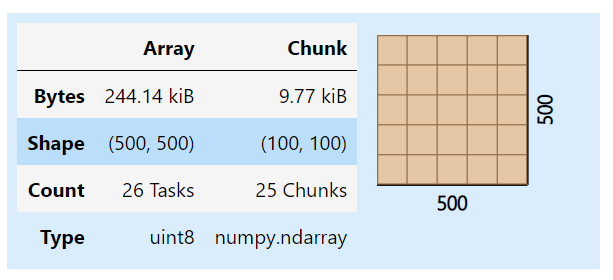
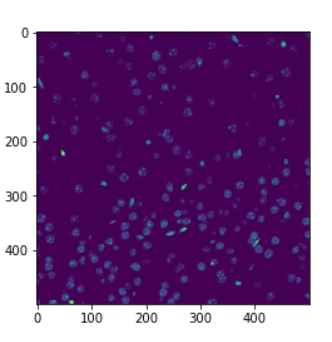

# [Azaya](https://github.com/Azaya89)'s Zarr collection.

## Twitter Mentions:

- https://twitter.com/rajadain/status/1574097645806682121

- https://twitter.com/latlong_blog/status/1543726888908009472?s=20&t=-ydMJPjiK47szWDjB7EIZw

- https://twitter.com/ruth_mottram/status/1580130892692918272?s=20&t=-ydMJPjiK47szWDjB7EIZw

-----

## Youtube mentions:

- https://www.youtube.com/watch?v=RLHM5MQ5kAs

- https://www.youtube.com/watch?v=0bqpxX3Nn_A

- https://www.youtube.com/watch?v=oWltJsPlIaQ&t=173s

----

## Code Snippets and visualisation:

- [Tiled image file formats: zarr](https://haesleinhuepf.github.io/BioImageAnalysisNotebooks/32_tiled_image_processing/tiled_image_file_formats_zarr.html)

        import zarr
        import dask.array as da
        import numpy as np
        from skimage.io import imread
        import pyclesperanto_prototype as cle
        from pyclesperanto_prototype import imshow
        from numcodecs import Blosc

        image = imread('../../data/P1_H_C3H_M004_17-cropped.tif')[1]

        image = image[1000:1500, 1000:1500]

        #compress AND change the numpy array into a zarr array
        compressor = Blosc(cname='zstd', clevel=3, shuffle=Blosc.BITSHUFFLE)

        chunk_size = (100, 100)

        zarray = zarr.array(image, chunks=chunk_size, compressor=compressor)

        zarr_filename = '../../data/P1_H_C3H_M004_17-cropped.zarr'
        zarr.convenience.save(zarr_filename, zarray)

        zarr_result = da.from_zarr(zarr_filename)
        zarr_result

    

        result = zarr_result.compute()
        cle.imshow(result)

    

- [Forest risks](https://decks.carbonplan.org/pangeo-showcase/10-27-21)

        import xarray as xr
        import fsspec

        store = fsspec.get_mapper('https://carbonplan.blob.core.windows.net/carbonplan-forests/risks/results/web/fire.zarr')

        ds = xr.open_zarr(store, consolidated=True)

    